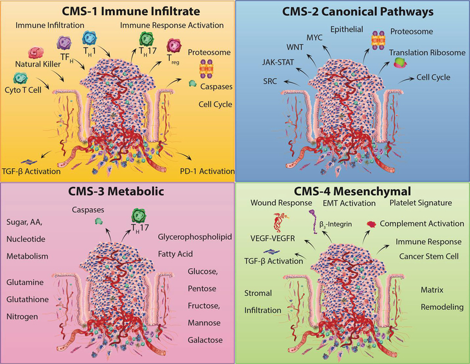

```{r global, include=FALSE}
library(flexdashboard)
library(shiny)
library(shinydashboard)
library(tidyverse)

theme_set(theme_classic())

```

```{r data}
#https://stats.stackexchange.com/questions/495981/update-beta-distributed-prior-with-data-that-is-a-probability
N=1000
p=0.5
n=1000
a=1+p*n
b=1+(n-p*n)

subtype_distributions =
    list(
        "Not certain" = function()rbeta(N,10,10),
        "More-than-not certain" = function()rbeta(N,2,1),
        "Kinda certain" = function()rbeta(N,3,1),
        "Sorta certain" = function()rbeta(N,4,1),
        "Pretty certain" = function()rbeta(N,5,1)
    )

cms1probas <- subtype_distributions[["Not certain"]]()
cms2probas <- subtype_distributions[["Not certain"]]()
cms3probas <- subtype_distributions[["Not certain"]]()
cms4probas <- subtype_distributions[["Pretty certain"]]()

example_subtype_credible_data <- 
    tibble(
        lwr = c(
            quantile(cms1probas,c(0.025)) %>% unname,
            quantile(cms2probas,c(0.025)) %>% unname,
            quantile(cms3probas,c(0.025)) %>% unname,
            quantile(cms4probas,c(0.025)) %>% unname
        ),
        m = c(
            mean(cms1probas),
            mean(cms2probas),
            mean(cms3probas),
            mean(cms4probas)
        ),
        upr = c(
            quantile(cms1probas,c(0.975)) %>% unname,
            quantile(cms2probas,c(0.975)) %>% unname,
            quantile(cms3probas,c(0.975)) %>% unname,
            quantile(cms4probas,c(0.975)) %>% unname
        ),
        subtype = c(
            "CMS1",
            "CMS2",
            "CMS3",
            "CMS4"
        )
    )
```

Welcome
=====

<div style="font-family: Arial, Helvetica, sans-serif;">

<h2>Increasing the confidence in colorectal cancer subtyping and inferring treatment options</h2>

<h3>Are you a researcher?</h3>

Choose 'For researchers' above

<h3>Are you a physician scientist?</h3>

Choose 'For physician scientists' above

<h3>Are you a developer?</h3>

Choose 'For developers' above

</div>

For researchers {.storyboard}
======

### Overview of colorectal cancer (CRC)

Colorectal cancer is the third most lethal cancer and the most prevalent of the gastrointestinal system.

There are four molecular subtypes i.e. the consensus molecular subtype (CMS) that explain colorectal cancers.

### CRC subtyping

The CMS is a subtyping classification based on marker expression data across expert groups [Ref](https://www.nature.com/articles/nm.3967). 

<div style="height=50px; text-align: center;">
```{r}

```
</div>

### Subtyping your CRC data

**Parameters: Data types available to select**

To closely mirror algorthmic subtyping, please indicate abberant expression of this group of genes:


```{r, class="cms_input"}

fluidPage(
  fluidRow(
    shiny::textInput("cohort_size","Cohort size",value=c(100),placeholder = 100)
  ),
  fluidRow(
    h3("CMS1: "),
    shinydashboard::box(
      shiny::radioButtons(
        inputId = "cms1",
        label="",
        choices = c(
          "Not certain","More-than-not certain","Kinda certain",
          "Sorta certain","Pretty certain"
          ),
        selected = "Not certain"
        )
      ),
    h3("CMS2: "),
    shinydashboard::box(
      shiny::radioButtons(
    inputId = "cms2",
    label="",
    choices = c(
        "Not certain","More-than-not certain","Kinda certain","Sorta certain","Pretty certain"
        ),
    selected = "Not certain"
    )
    )
    ),
  fluidRow(
    h3("CMS3: "),
    shinydashboard::box(
      shiny::radioButtons(
        inputId = "cms3",
        label="",
        choices = c(
          "Not certain","More-than-not certain","Kinda certain",
          "Sorta certain","Pretty certain"
          ),
        selected = "Not certain"
        )
      ),
    h3("CMS4: "),
    shinydashboard::box(
        shiny::radioButtons(
    inputId = "cms4",
    label="",
    choices = c(
        "Not certain","More-than-not certain","Kinda certain",
        "Sorta certain","Pretty certain"
        ),
    selected = "Not certain"
    )
    )
    )
  )

actionButton("goButton", 
                             HTML("Comput subtype classification"),
                             style="font-weight: bold; word-wrap: break-word;"
                )

subtypeProbas <- reactiveValues()

observeEvent(input$goButton,{
  cms1_distr <- subtype_distributions[[input$cms1]]()
  cms2_distr <- subtype_distributions[[input$cms2]]()
  cms3_distr <- subtype_distributions[[input$cms3]]()
  cms4_distr <- subtype_distributions[[input$cms4]]()
    subtypeProbas$cms1_probas <- 
        cms1_distr %>% as.numeric()
    subtypeProbas$cms2_probas <- 
        cms2_distr %>% as.numeric()
    subtypeProbas$cms3_probas <- 
        cms3_distr %>% as.numeric()
    subtypeProbas$cms4_probas <- 
        cms4_distr %>% as.numeric()
})

subtypeProbasDT <- 
    reactive({
        tibble(
            values = c(
                subtypeProbas$cms1_probas,
                subtypeProbas$cms2_probas,
                subtypeProbas$cms3_probas,
                subtypeProbas$cms4_probas
            ),
            subtype = c(
                rep("CMS1",N),
                rep("CMS2",N),
                rep("CMS3",N),
                rep("CMS4",N)
                )
        )
    })
```

### Subtyping confidence

How much evidence do we need to accurately classify a disease subtype?

What are the data elements that can increase or decrease our confidence?

How uncertain are we of the classification and what other data would be needed to increase the confidence?

```{r credible_data}

renderPlot({

subtypeProbasDT() %>% 
        group_by(subtype) %>% 
        summarize(
            lwr = mean(values) - sd(values),
            m = mean(values),
            upr = mean(values) + sd(values)
        ) %>% 
        ggplot(aes(m,subtype)) + 
        geom_point() + 
        geom_errorbarh(
            aes(xmin=lwr,xmax=upr),
            width=0.1
            ) +
        scale_x_continuous(lim=c(0,1)) + 
        xlab("Credible Interval") + 
        ylab("") + 
        theme(
            legend.position = "none",
            axis.ticks.y = element_blank(),
            axis.line.y  = element_blank(),
            axis.text.x = element_text(size=10,face="bold"),
            text = element_text(size=16,face="bold")
            )

},height = 200)

```


*** 

The certainty of subtyping versus being in another subtype

```{r}

flexdashboard::renderGauge({
    tab <- 
        subtypeProbasDT() %>% 
        group_by(subtype) %>% 
        summarize(m = mean(values)) %>% 
        arrange(m) %>% 
        tail(1)
    val <- 
        tab %>% select(m) %>% unlist %>% unname
    name <- 
        tab %>% select(subtype) %>% unlist %>% unname
    flexdashboard::gauge(
    round(
        val,
        2), 
    min = 0, max = 1, label = name,symbol = '%', 
                     flexdashboard::gaugeSectors(
                         success = c(80, 100), warning = c(40, 79), danger = c(0, 39)
                         )
                     )
})

```

Perspective on future research or changes to be made.

For physician scientists {.storyboard}
======

### Overview of colorectal cancer (CRC)

If we have data from a patient, what is our confidence level for the patient having a disease subtype?

How confident are we in classifying the patient?

How uncertain are we in our classification and what data needs to be collected to increase our confidence?

### CRC subtyping and treatment

### Your patient's CRC data

### Treatment option confidence

```{r}

rate <- 50
flexdashboard::gauge(rate, min = 0, max = 100, symbol = '%', 
                     flexdashboard::gaugeSectors(
                         success = c(80, 100), warning = c(40, 79), danger = c(0, 39)
                         )
                     )

```

*** 

This is the confidence scale with uncertainty

For developers
======

Column
------

```{r,eval=F}

tibble(
    value = c(0,rbeta(100,1,1),1)
) %>% 
    ggplot(aes(value)) +
    geom_density()

```

### Not certain of any subtype by my data

```{r subtype_not_certain_example}

tibble(
    subtype = c(
        rep("CMS1",N),
        rep("CMS2",N),
        rep("CMS3",N),
        rep("CMS4",N)),
    probability = c(
        subtype_distributions[["Not certain"]](),
        subtype_distributions[["Not certain"]](),
        subtype_distributions[["Not certain"]](),
        subtype_distributions[["Not certain"]]()
        )
) %>% 
    ggplot(aes(probability,color=subtype)) +
    geom_density() +
    xlab("Probability") +
    ylab("Likelihood")

```

### Pretty certain of CMS1 subtype by my data

```{r subtype_certain_example}

tibble(
    subtype = c(
        rep("CMS1",N),
        rep("CMS2",N),
        rep("CMS3",N),
        rep("CMS4",N)),
    probability = c(
        subtype_distributions[["Pretty certain"]](),
        subtype_distributions[["Not certain"]](),
        subtype_distributions[["Not certain"]](),
        subtype_distributions[["Not certain"]]()
        )
) %>% 
    ggplot(aes(probability,color=subtype)) +
    geom_density() +
    xlab("Probability") +
    ylab("Likelihood")

```
